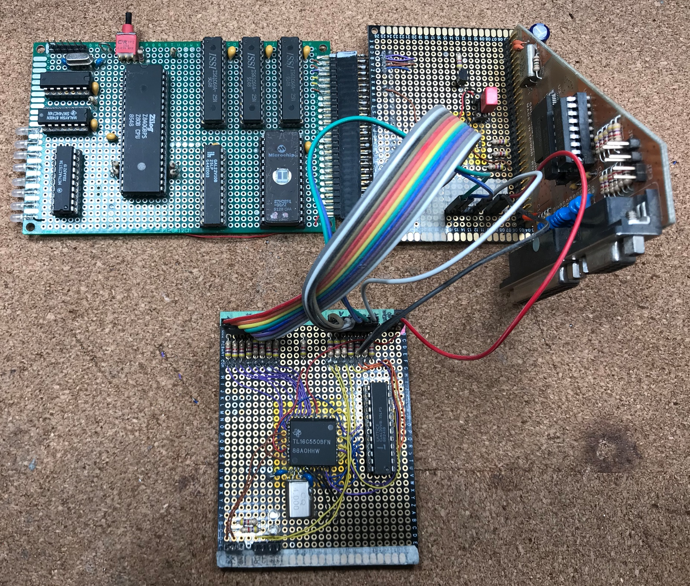

# C00F-80

---
> A Lockdown-inspired Junkbox Z80 System

## Overview
Designed and built from on-hand parts in early 2020, COOF-80 (stylized in hexadecimal compatible as C00F-80) is Z80 system implementation that would be relatively sophisticated if it was 1980. Unfortunately it is not 1980, so it's more of an example of the most basic level of computing and a fun toy model computer to play with. Includes a simple and probably buggy interactive ROM monitor.

[]

## Specifications
* Built using advanced perfboard technology
* Z80 microprocessor running at up to 4MHz
* Precision crystal oscillator with selectable clock divide factors (÷1, ÷2, ÷4)
* 8KB EPROM
* 24KB fast static RAM
* High-speed 16C550 UART for serial communication
* Byte-wide bank of blinkenlights for efficient human interfacing

## Included Files
* **/Design**
    * **C80-schematic.pdf**
    * **C80-schematic.png**
        * Schematic in PDF and PNG format
    * **COOF-80/**
        * KICAD 6 project
        * Currently there is no PCB design
* **/ASM**
    * **MAKE.BAT**
        * Builds included files using TASM32 (not included, place in path)
        * Generated binary images in intel hex format are placed in ./bin/
    * **blinkenlights.asm**
        * Basically hello world
        * Implements ping-pong scrolling LED effect suitable for installation on the grille of a 1982 Pontiac Trans-Am
    * **z80monitor.asm**
        * ROM monitor for interactive development and debugging
        * Uses UART interface for console
* **/GAL**
    * **z80logic.PLD**
    * **z80logic.jed**
        * PLD equations and synthesized JEDEC file for system glue logic GAL
    * **16C550.PLD**
    * **16C550.jed**
        * PLD equations and synthesized JEDEC file for UART glue logic GAL
    * **z80logic.ods**
        * Prettified truth table of system glue logic in LibreOffice Calc format

## Development
* Firmware was built using TASM32 ('Telemark Assembler', not to be confused with 'Turbo Assembler'), a vintage freeware assembler for Windows (and apparently Linux). Source may or may not be directly compatible with other assemblers.
    * https://www.ticalc.org/archives/files/fileinfo/250/25051.html
* PLD code was built using ~~Atmel's~~ Microchip's WinCUPL
    * https://www.microchip.com/en-us/development-tool/WinCUPL
* ASM80 is quite handy for development
    * https://www.asm80.com/
* As is ZEMU by Joe Moore
    * http://www.z80.info/zip/zemu.zip
    * http://www.z80.info/z80emu.htm
## ROM Monitor
### CLI Commands
```
d[ump] <hexaddr> <hexlen>
	Dump <hexlen> bytes memory starting at <hexaddr>
x[ecute] <hexaddr>
	Jump to <hexaddr> and execute
c[all] <hexaddr>
	Call <hexaddr> and return to monitor
f[ill] <hexaddr> <hexlen> <hexval>
	Fill <hexlen> bytes starting at <hexaddr> with <hexval>
:ihxstring
	Load Intel hex string into memory
w[rite] <hexval> <hexaddr>
    Write <hexval> to memory location <hexaddr>
i[nput] <hexport>
	Read <hexport> and print the value (high order byte ignored)
o[utput] <hexport> <hexval>
	Write <hexval> to <hexport> (high order byte ignored)
```
### Monitor API Routines
```
Call IDs:
 	0x00 - NOP
 	0x01 - Get character from UART, returned in A
	0x02 - Send character in A to UART
	0x03 - Send zero-terminated string pointed to by HL to UART
	0x04 - Split rxbuf and place in argbuf
	0x05 - Convert byte in A to ASCII hex, leave two chars in HL
	0x06 - Convert two ASCII chars in HL to byte, leave byte in A
	0x07 - Delay number of loops specified by HL
	0x08 - Get argbuf address and return it in HL
	0x09 - Get rxbuf address and return it in HL
	0x0A - Get substring index in A from argbuf, return address in IX
Calling convention:
 	- Push call number on stack
	- Load registers as appropriate for the API call being used
	- Execute RST 08h
```